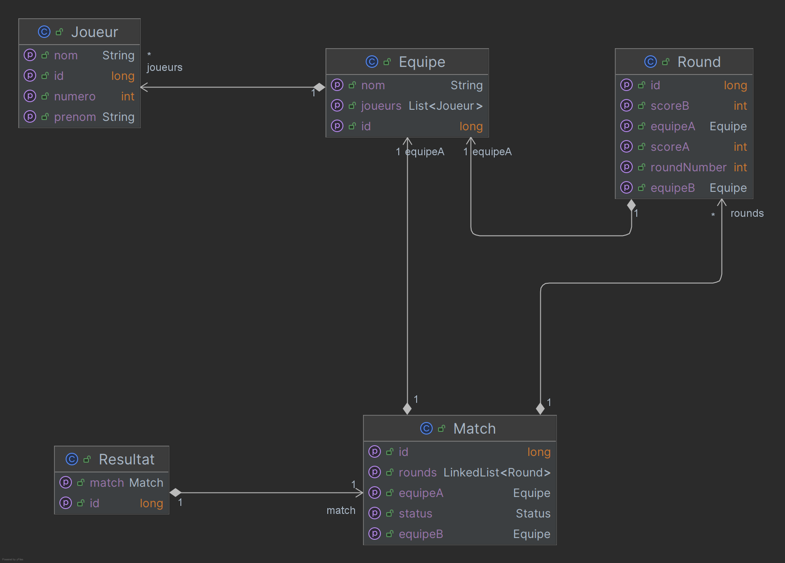

# TP Spring boot - JPA - Hibernate

## Objectif

L'objectif de ce TP est de progressivement mettre en place une application Spring boot qui utilise JPA pour gérer des données depuis une base de données.

C'est l'occasion de parler des concepts suivants : 

- Injection de dépendances
- Configuration
- Exposer une API REST
- JPA
- Transactions
- Tests
- AOP (Aspect Oriented Programming)
- Sécurité

## Prérequis

- Java 17 minimum, le projet a été testé et configuré avec java 21
- Avoir docker et docker compose installé sur sa machine OU une base de données mysql / mariadb accessible
- Un IDE

## Présentation fonctionnelle du projet

Le projet est une application de gestion des scores d'un match [d'un sport non imposé, faites-vous plaisir]. 
Pour l'instant elle ne permet que de consulter via Java des scores pré-définis (qu'on appelle aussi "bouchonnés", "mocked" en anglais), mais l'objectif est de pouvoir ajouter des scores, des matchs, des équipes, des joueurs, etc. et d'y accéder par API REST.

## Présentation technique du projet

Le projet initial, TournamentMaster3000, est un projet maven avec des sources java et des tests unitaires.

Le code est séparé en 4 packages principaux :

- controller : les classes qui exposent les API REST (pour l'instant, rien n'est exposé)
- model : les classes qui représentent le modèle de données de l'application
- repository : les classes qui permettent de manipuler la source des données [en base de données par exemple]
- service : les classes qui contiennent la logique métier de l'application et font le lien entre les controllers et les repositories

Le modèle de données est le suivant :

Note : L'appellation Round est utilisée au lieu de Set pour éviter les confusions avec la collection Set de Java.

## Import du projet

Il faut importer le projet TournamentMaster3000 dans votre IDE en tant que projet maven.

Si besoin, faire un `mvn clean install` pour télécharger les dépendances.

Pour l'instant, le projet ne compile pas donc la commande mvn finira en échec.

## Déroulé du TP

En partant de la branche main, il y a des TODO numérotés dans le code pour vous guider dans les étapes à suivre.

En cas de blocage ou pour vérifier, les solutions sont disponibles dans les autres branches, i.e. 1-solution, 2-solution, etc. Elles peuvent aussi être utilisées comme point de départ pour repartir d'un projet propre.

Note: Pour le TP 3 par exemple il y a une branche 3-depart qui contient des éléments de configuration à récupérer pour arriver au bout, mais qui ne sont pas des objectifs d'apprentissage.